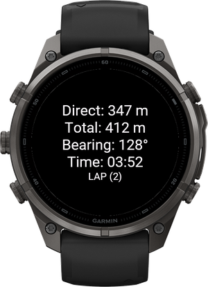
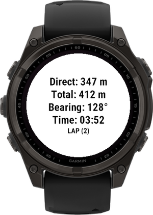
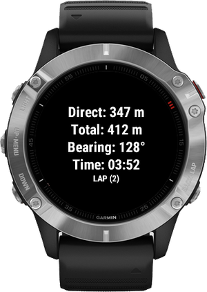
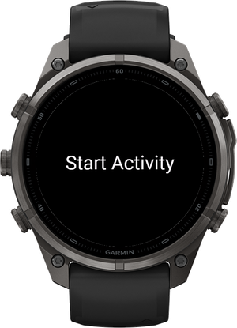
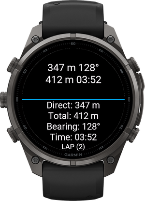
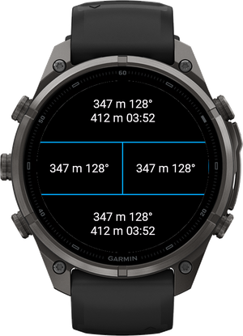
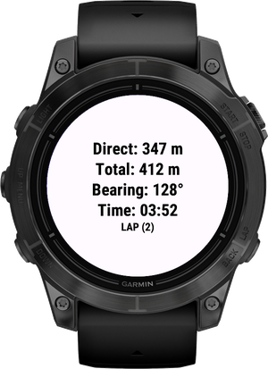
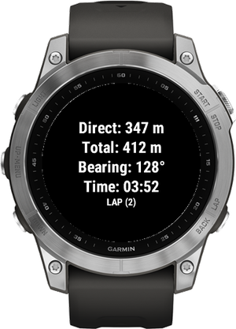
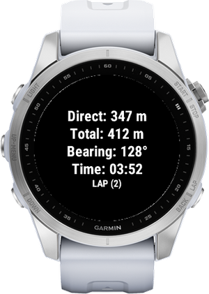
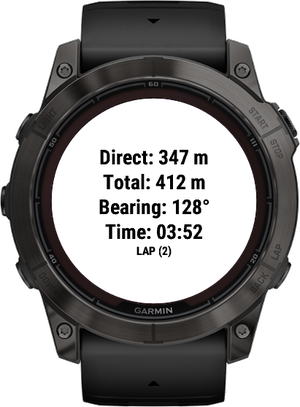

# GPS Tracker DataField

A Garmin Connect IQ data field for orienteering and navigating in the field.
It shows how far and in which direction you have moved from a reference point that you set with the **LAP** button,
together with the distance actually travelled and the time since that point.

<p align="center">
  
  
  
</p>

## How it works

1. Add the data field to an activity screen and start the activity.
   Until the activity timer is started the field shows **Start Activity**.
2. The first GPS position after the start becomes the **reference point**.
3. Press **LAP** whenever you want to set a new reference point at your current position,
   e.g. at a control point. All values start again from zero and the LAP counter increases.
4. While you move, the field shows:

| Value | Meaning |
|-------|---------|
| **Direct** | Straight-line distance from the reference point to your current position, in meters |
| **Total** | Distance actually travelled since the reference point, in meters |
| **Bearing** | Direction from the reference point to your current position, in degrees (0° = north, 90° = east) |
| **Time** | Time elapsed since the reference point was set (MM:SS) |
| **LAP (n)** | How many times the reference point was reset with LAP |

- **Total** is only counted while the timer is running, so it does not grow when the activity is paused.
- Saving or discarding the activity clears the reference point and all values.

## Layout on different data field sizes

The field adapts to the space it gets on the activity screen. On round screens it also takes the curved
screen edge into account, so no text is cut off.

| Before start | Full screen | 2 fields | 4 fields |
|:---:|:---:|:---:|:---:|
|  |  |  |  |

- **Full** – 4 labelled lines and the LAP counter, used when there is enough space.
- **Compact** – 2 lines without labels: `direct bearing` and `total time`.
- **Minimal** – 1 line: `direct bearing`, used in the smallest fields.

The largest font that fits is chosen for the field size, and it does not change while the values grow.

## Settings

| Setting | Options |
|---------|---------|
| **Theme** | **Dark** (default) – white text on black background<br>**Light** – black text on white background<br>**Follow watch** – uses the data field background color set on the watch |

Settings can be changed in the Garmin Connect IQ app when the data field is installed from the Connect IQ Store.
A manually copied `.prg` file uses the default values.

<p align="center">
  
</p>

## Supported devices

| Series | Models |
|--------|--------|
| **fēnix 9** | fēnix 9 43mm, fēnix 9 47mm / 51mm, fēnix 9 Pro 43mm, fēnix 9 Pro 47mm, fēnix 9 Pro 51mm, fēnix 9 Pro Solar 47mm, fēnix 9 Pro Solar 51mm |
| **fēnix 8 / E** | fēnix 8 43mm, fēnix 8 47mm / 51mm (also tactix 8 and quatix 8), fēnix 8 Pro 47mm / 51mm (also quatix 8 Pro), fēnix 8 Solar 47mm, fēnix 8 Solar 51mm (also tactix 8 Solar 51mm), fēnix E |
| **fēnix 7** | fēnix 7 (also quatix 7), fēnix 7 Pro, fēnix 7 Pro Solar (no Wi-Fi), fēnix 7S, fēnix 7S Pro, fēnix 7X (also tactix 7, quatix 7X Solar, Enduro 2), fēnix 7X Pro, fēnix 7X Pro Solar (no Wi-Fi) |
| **fēnix 6** | fēnix 6 / 6 Solar / 6 Dual Power, fēnix 6 Pro (also 6 Sapphire, 6 Pro Solar, 6 Pro Dual Power, quatix 6), fēnix 6S / 6S Solar / 6S Dual Power, fēnix 6S Pro (also 6S Sapphire, 6S Pro Solar, 6S Pro Dual Power), fēnix 6X Pro (also 6X Sapphire, 6X Pro Solar, tactix Delta, quatix 6X) |
| **fēnix 5 Plus** | fēnix 5 Plus, fēnix 5S Plus, fēnix 5X Plus |
| **epix** | epix (Gen 2) (also quatix 7 Sapphire), epix Pro (Gen 2) 47mm (also quatix 7 Pro), epix Pro (Gen 2) 51mm (also D2 Mach 1 Pro, tactix 7 AMOLED) |
| **Enduro** | Enduro, Enduro 3 |
| **Forerunner** | Forerunner 245, 245 Music, 255, 255 Music, 265, 570 47mm, 645 Music, 745, 945, 945 LTE, 955 / Solar, 965, 970 |
| **Instinct** | Instinct 3 AMOLED 50mm |
| **MARQ** | MARQ Adventurer, Athlete, Aviator, Captain, Commander, Driver, Expedition, Golfer |
| **Venu / vívoactive** | Venu 2, Venu 2 Plus, Venu 3, Venu 4 45mm (also D2 Air X15), vívoactive 3 Music, vívoactive 4 |
| **D2** | D2 Air X10, D2 Mach 1, D2 Mach 2, D2 Mach 2 Pro |
| **Descent** | Descent Mk2 / Mk2i, Descent Mk2 S, Descent Mk3i 51mm |
| **Other** | Approach S70 47mm, Darth Vader, First Avenger |

Other devices can be added in `manifest.xml`. Devices with a round 240, 260, 280, 416, 454 or 466 px screen
use layouts already checked in the simulator.

<p align="center">
  
  
  
</p>

## Installation

1. Download the `.prg` file built for your watch model.
2. Connect the watch with a USB cable and copy the file to the `GARMIN/APPS` folder.
3. Disconnect the watch and add the data field to an activity screen in the activity settings.

## Development

### Requirements

- Garmin Connect IQ SDK **9.x** or newer (fēnix 8 and fēnix 9 require API level 6.0)
- Developer key for signing

### Building

Build for a single device:

```bash
monkeyc -d fenix9pro47mm -f monkey.jungle -o bin/orienteringHelper.prg -y /path/to/developer_key
```

Build a package for all supported devices:

```bash
monkeyc -e -f monkey.jungle -o bin/orienteringHelper.iq -y /path/to/developer_key
```

### Running in the simulator

```bash
connectiq
monkeydo bin/orienteringHelper.prg fenix9pro47mm
```

- **Data Fields → Background Color** changes the data field background (used by the *Follow watch* theme).
- **Data Fields → Layout** changes the number of fields on the screen.
- GPS positions come from a recorded activity: **Simulation → Activity Data → Load File** (FIT file).

The screenshots in this README were taken in the Connect IQ simulator with sample values.

## Author

Dominik Pietrzak

## License

This project is licensed under the MIT License - see the <a target="_blank" href="https://mit-license.org/">LICENSE</a> for details.
